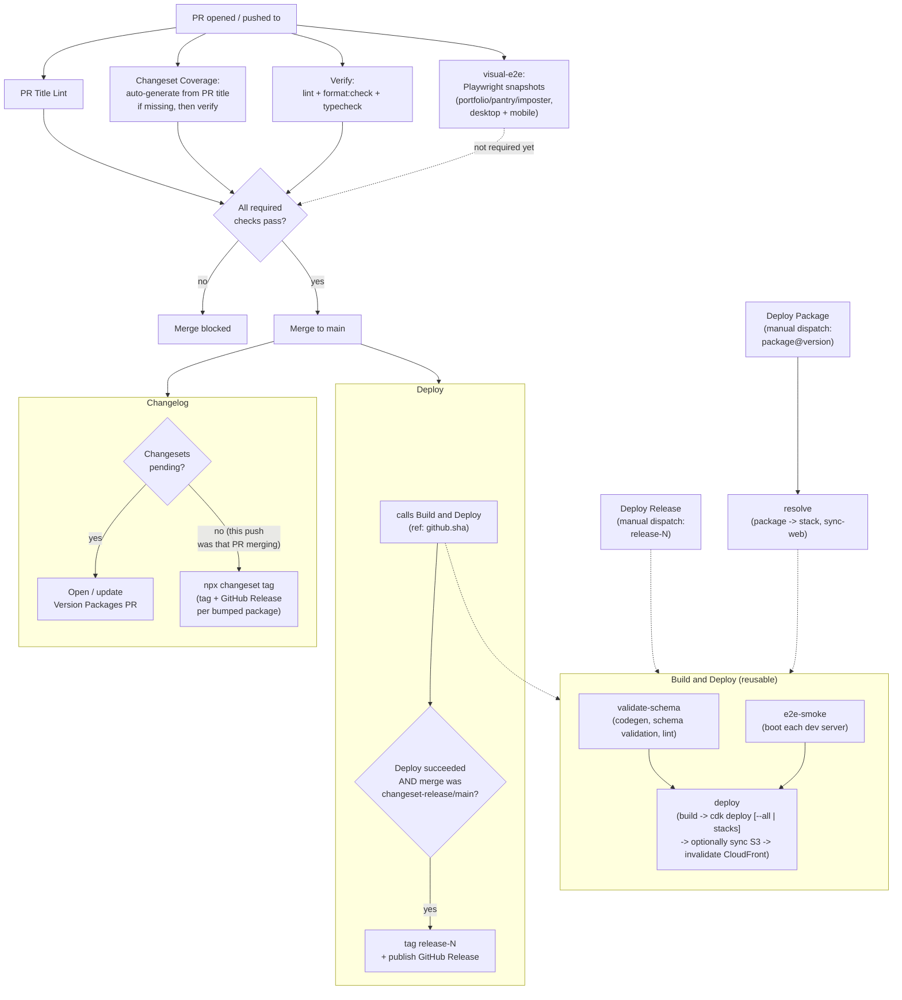

# CI workflows

| Workflow                | File                                             | Trigger                      | Purpose                                                                                                                                                                                                                                                                                                                                                                                                                                                                                                                                                                    |
| ----------------------- | ------------------------------------------------ | ---------------------------- | -------------------------------------------------------------------------------------------------------------------------------------------------------------------------------------------------------------------------------------------------------------------------------------------------------------------------------------------------------------------------------------------------------------------------------------------------------------------------------------------------------------------------------------------------------------------------- |
| **PR Title Lint**       | [`pr-title-lint.yml`](./pr-title-lint.yml)       | PR opened / edited / synced  | Enforces the PR title as a Conventional Commit (`type(scope): subject`), scope restricted to real workspaces/projects - see root [`commitlint.config.mjs`](../../commitlint.config.mjs). **Required to merge.**                                                                                                                                                                                                                                                                                                                                                            |
| **Changeset Coverage**  | [`changeset-check.yml`](./changeset-check.yml)   | PR opened / synced           | First tries to auto-generate a changeset from the PR title (`feat`->minor, `!`->major, else->patch) covering every touched package, if none exists yet - commits it back onto the PR. Then diffs the PR against `main` and fails - naming exactly which package(s) - if anything touched still has no changeset (unparseable title, or an empty changeset explicitly declaring "no bump needed"). Skips both steps entirely for the Changelog workflow's own `changeset-release/*` PR, which consumes (deletes) changesets rather than adding them. **Required to merge.** |
| **Verify**              | [`verify.yml`](./verify.yml)                     | PR opened / synced           | Runs `lint`, `format:check`, and `typecheck` (the same three checks as `.husky/pre-push`) against the PR branch. Exists because a GitHub UI merge never runs local git hooks, so without this, unformatted/unlinted/type-broken code could merge straight into `main` undetected - which is exactly what let a `prettier`-breaking change land and silently stall the Changelog workflow's own push to `changeset-release/main` for two release cycles. **Required to merge.**                                                                                             |
| **Verify / visual-e2e** | [`verify.yml`](./verify.yml)                     | PR opened / synced           | Boots the real `web` app against each project's real (in-memory mock) dev server and takes Playwright screenshots of the portfolio home, pantry, and imposter setup pages at a desktop and a mobile (Pixel 7 viewport, still Chromium) size, diffed against committed baselines in `web/e2e/*-snapshots/`. Deterministic - the mock resolvers return fixed fixture data, no live AWS/production dependency. Not yet a required check.                                                                                                                                      |
| **Changelog**           | [`changesets.yml`](./changesets.yml)             | Push to `main`               | If changesets are pending, opens/updates a "Version Packages" PR (bumps versions, writes `CHANGELOG.md`s). Once _that_ PR is merged (no changesets left pending), instead tags each bumped package as `<name>@<version>` and creates a GitHub Release per tag from its changelog entry. Never runs `npm publish` - every package here is private.                                                                                                                                                                                                                          |
| **Deploy**              | [`deploy.yml`](./deploy.yml)                     | Push to `main`               | Calls **Build and Deploy** for `github.sha` (full bundle). If that succeeds _and_ the push was a Version Packages PR merge (branch `changeset-release/main`), also tags the commit `release-N` (auto-incrementing) and publishes a matching GitHub Release - a pinned snapshot of what every package looked like together, only ever created from a deploy that's already been verified to work.                                                                                                                                                                           |
| **Deploy Release**      | [`deploy-release.yml`](./deploy-release.yml)     | Manual (`workflow_dispatch`) | Rollback, whole-site: takes a `release-N` tag as input and calls **Build and Deploy** for it - redeploys every stack + the web bundle exactly as they were at that release. Doesn't mint a new release itself. Refuses to proceed if it would replace a stateful resource, unless `allow-replacements` is set.                                                                                                                                                                                                                                                             |
| **Deploy Package**      | [`deploy-package.yml`](./deploy-package.yml)     | Manual (`workflow_dispatch`) | Rollback, single package: takes a `<package>@<version>` tag (the ones Changelog already creates), maps it to that package's CDK stack, and calls **Build and Deploy** scoped to just that stack - leaves every other package as currently deployed. `portfolio`/`web` both map to `PetertranSiteStack` (they share it - see `infra/lib/site-stack.ts`); only `web` also re-syncs S3/CloudFront. Same `allow-replacements` guard as Deploy Release.                                                                                                                         |
| **Build and Deploy**    | [`build-and-deploy.yml`](./build-and-deploy.yml) | Reusable (`workflow_call`)   | The actual pipeline shared by all three above: build, check for destructive resource replacements (see below), and `cdk deploy` (`--all` or a specific `stacks` input), optionally sync `web/dist` to S3 and invalidate CloudFront (`sync-web` input). `validate-schema` (codegen, schema validation, lint) and `e2e-smoke` (boot each dev server) job definitions are still present but disabled (`if: false`) and no longer gate `deploy`.                                                                                                                               |

## How they fit together

The Version Packages PR the bot opens is a normal PR - it goes through the exact same top loop (PR Title Lint, Changeset Coverage, merge) as any other PR before it lands and triggers the "no changesets pending" branch above.

**Why `Build and Deploy` checks for destructive replacements before rollbacks**: an old ref's CDK stack definition can differ from what's currently deployed in a way CloudFormation can't apply as an in-place update - e.g. a resource's name changed from CDK-generated to explicit (or back) since that ref was tagged. CloudFormation's only option then is to delete the old physical resource and create a new one. For anything stateful with `removalPolicy: DESTROY` (every table/bucket in this repo) and no point-in-time recovery, that's permanent, unrecoverable data loss the moment the deploy runs - not something to discover after the fact. `cdk diff` already tags every such property change with `(requires replacement)` or `(may cause replacement)`; the check just greps the diff for those two phrases before `cdk deploy` ever runs, and fails the job if either appears. Scoped to rollbacks only (`allow-replacements: false` by default in `build-and-deploy.yml`) - `deploy.yml` opts back in (`allow-replacements: true`) since a forward push's infra changes are already the intent, not a surprise.

**Why Changeset Coverage checks out with `secrets.CHANGESET_PAT` instead of the default token**: a `pull_request` run whose triggering commit was authored via `GITHUB_TOKEN` always lands in an approval-required state - GitHub's guard against a workflow pushing code and having its own subsequent run silently satisfy a required status check with no human involved. Since the auto-generate step's whole point is to push a commit unattended, every one of those pushes would otherwise need a manual "approve and run" click before merging - using a real account's token instead sidesteps that gate entirely, since the push is then attributed to a person, not a bot.

## Local equivalents

Every check above has a local command you can run before pushing:

- `npx commitlint --edit <file>` - what PR Title Lint enforces on the PR title (Husky's `commit-msg` hook already runs this per-commit).
- `PR_TITLE="feat(pantry): ..." node scripts/generate-changeset.mjs` - what Changeset Coverage tries first; writes `.changeset/auto-*.md` from the title + touched packages if none exists yet.
- `node scripts/check-changeset-coverage.mjs` - what Changeset Coverage verifies afterward; diffs your branch against `origin/main` and fails naming any package still missing a changeset.
- `npm run changeset` - add a changeset interactively (or a richer one than the auto-generated version would produce); `npx changeset add --empty` for the no-bump escape hatch.
- `npm run version-packages` (`changeset version`) - apply pending changesets locally (bumps versions, writes changelogs) without needing a merged PR.
- `npm run verify` (`turbo run lint format:check typecheck build`) - most of what `validate-schema`/`deploy`'s build step check, runnable in one shot.
- `npm run test:e2e --workspace=web` - what `visual-e2e` checks; boots the real dev servers + Vite and diffs screenshots against `web/e2e/*-snapshots/`. `npm run test:e2e:update --workspace=web` regenerates the baselines after an intentional visual change.
- `gh release list` / `git tag -l 'release-*'` - find a whole-site release to roll back to. `git tag -l '*@*'` - find a single package's version tag.
- `gh workflow run deploy-release.yml -f release=release-12` - trigger a whole-site rollback from the CLI.
- `gh workflow run deploy-package.yml -f tag=pantry@1.4.0` - trigger a single-package rollback from the CLI.

## Branch protection

`lint-pr-title`, `changeset-coverage`, and `verify` are required status checks on `main` (`gh api repos/.../branches/main/protection`) - a PR can't merge while any of them fail, regardless of admin status.
