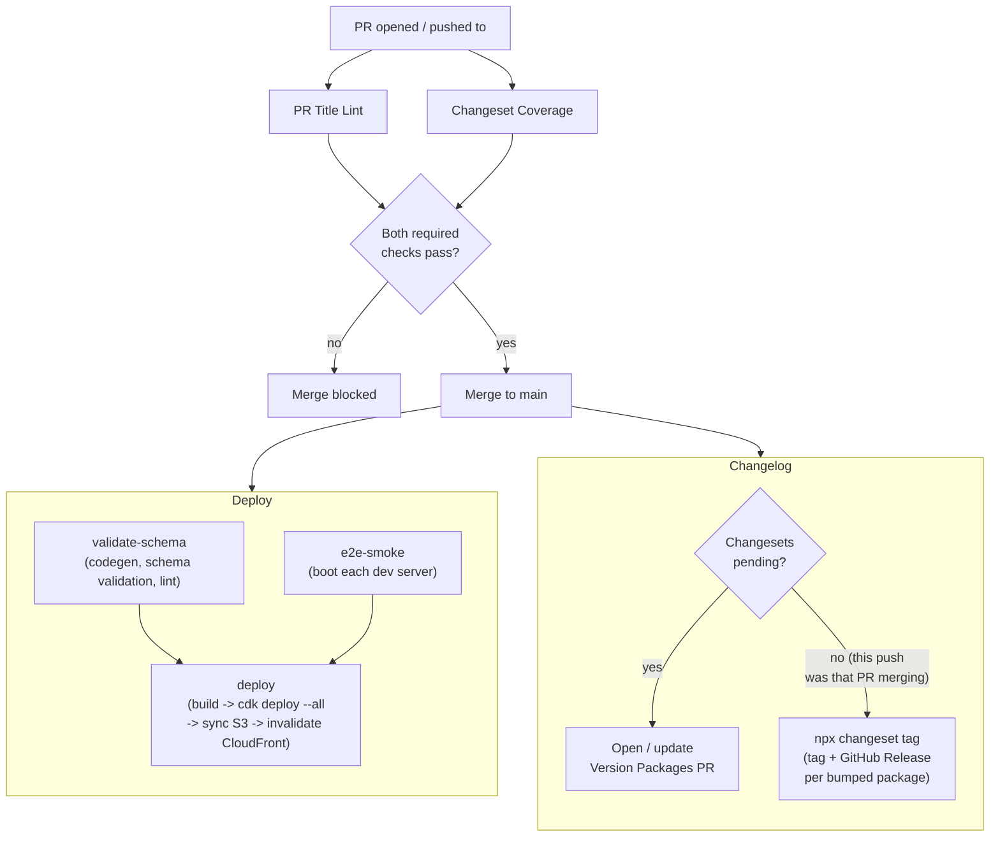

# CI workflows

| Workflow               | File                                           | Trigger                     | Purpose                                                                                                                                                                                                                                                                                                                                                                                                                         |
| ---------------------- | ---------------------------------------------- | --------------------------- | ------------------------------------------------------------------------------------------------------------------------------------------------------------------------------------------------------------------------------------------------------------------------------------------------------------------------------------------------------------------------------------------------------------------------------- |
| **PR Title Lint**      | [`pr-title-lint.yml`](./pr-title-lint.yml)     | PR opened / edited / synced | Enforces the PR title as a Conventional Commit (`type(scope): subject`), scope restricted to real workspaces/projects - see root [`commitlint.config.mjs`](../../commitlint.config.mjs). **Required to merge.**                                                                                                                                                                                                                 |
| **Changeset Coverage** | [`changeset-check.yml`](./changeset-check.yml) | PR opened / synced          | Diffs the PR against `main`, maps changed files to tracked packages, and fails - naming exactly which package(s) - if any touched package has no changeset. An empty changeset (`npx changeset add --empty`) is an explicit "no bump needed" escape hatch. Skips itself entirely for the Changelog workflow's own `changeset-release/*` PR, which consumes (deletes) changesets rather than adding them. **Required to merge.** |
| **Changelog**          | [`changesets.yml`](./changesets.yml)           | Push to `main`              | If changesets are pending, opens/updates a "Version Packages" PR (bumps versions, writes `CHANGELOG.md`s). Once _that_ PR is merged (no changesets left pending), instead tags each bumped package as `<name>@<version>` and creates a GitHub Release per tag from its changelog entry. Never runs `npm publish` - every package here is private.                                                                               |
| **Deploy**             | [`deploy.yml`](./deploy.yml)                   | Push to `main`              | Validates GraphQL/Anthropic schemas and lints, boots each service's dev server as a smoke test, and - only if both pass - builds everything and deploys (`cdk deploy --all`, sync `web/dist` to S3, invalidate CloudFront).                                                                                                                                                                                                     |

## How they fit together

The Version Packages PR the bot opens is a normal PR - it goes through the exact same top loop (PR Title Lint, Changeset Coverage, merge) as any other PR before it lands and triggers the "no changesets pending" branch above.

## Local equivalents

Every check above has a local command you can run before pushing:

- `npx commitlint --edit <file>` - what PR Title Lint enforces on the PR title (Husky's `commit-msg` hook already runs this per-commit).
- `node scripts/check-changeset-coverage.mjs` - what Changeset Coverage runs in CI; diffs your branch against `origin/main`.
- `npm run changeset` - add a changeset interactively; `npx changeset add --empty` for the no-bump escape hatch.
- `npm run version-packages` (`changeset version`) - apply pending changesets locally (bumps versions, writes changelogs) without needing a merged PR.
- `npm run verify` (`turbo run lint format:check typecheck build`) - most of what `validate-schema`/`deploy`'s build step check, runnable in one shot.

## Branch protection

`lint-pr-title` and `changeset-coverage` are required status checks on `main` (`gh api repos/.../branches/main/protection`) - a PR can't merge while either fails, regardless of admin status.
