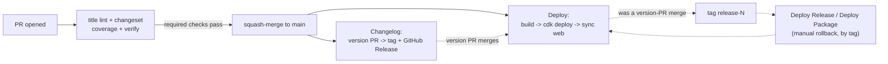
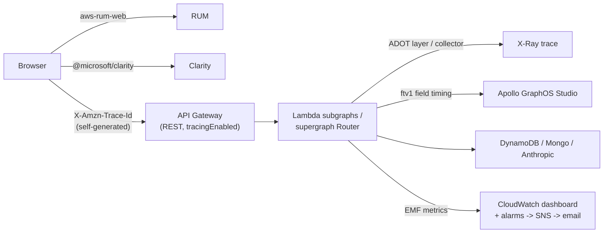
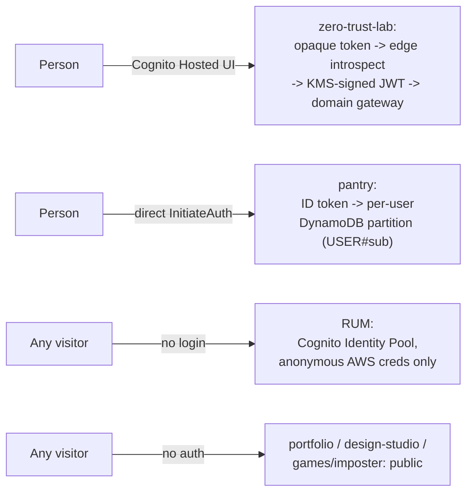

# petertran.au

My personal site - a resume that's also a live, publicly-queryable GraphQL API.
The site itself is served by the exact system its architecture diagram
describes: a federated GraphQL API (Apollo Router in front of several
independent Lambda subgraphs), deployed with AWS CDK, with real
CloudWatch/X-Ray metrics surfaced on the page itself.

Try the query explorer at [petertran.au](https://petertran.au), or point any
GraphQL client at [api.petertran.au/graphql](https://api.petertran.au/graphql)
directly and query it yourself.

**Live dashboards:**
[Apollo GraphOS Studio](https://studio.apollographql.com/graph/petertran-au/variant/current/home) ·
[SonarCloud](https://sonarcloud.io/project/overview?id=peter-tr_petertran.au)

## Stack

```
petertran.au/
├── web/      React + Vite frontend - one app per backend below, plus a
│             notes/writeup page and an "Ask Claude" (NL → GraphQL) explorer
├── api/      Each src/ subdirectory is an independent GraphQL backend
│   └── src/
│       ├── portfolio/       this resume/API site
│       ├── pantry/          AI-assisted grocery inventory + shopping list
│       ├── games/imposter/  a Werewolf/Mafia-style party game
│       ├── design-studio/   a mock-Canva design editor
│       ├── supergraph/      Apollo Router - composes the four above into
│       │                    one federated endpoint (api.petertran.au/graphql)
│       ├── shared/          code genuinely common to more than one backend
│       ├── zero-trust-lab/  edge/domain gateway + token-exchange learning
│       │                    exercise (see docs/zero-trust-lab.md)
│       └── warm-schedule/   keeps every project's Lambda warm on a schedule,
│                            toggleable from the site's /settings page
├── infra/    AWS CDK (TypeScript) - Lambda, DynamoDB, MongoDB Atlas, S3 +
│             CloudFront, Route 53, ACM, SES, Secrets Manager, WAF
└── .github/  CI/CD via GitHub Actions, authenticating to AWS via OIDC
```

Every project under `api/src/` other than `shared`, `zero-trust-lab`, and
`warm-schedule` is a fully independent backend - its own Lambda, database,
and CDK stack, versioned and released separately via
[Changesets](https://github.com/changesets/changesets) - fronted by one
shared API Gateway and stitched into a single federated endpoint by
`supergraph`'s Apollo Router.

## Running it locally

Requires Node 20+.

```bash
npm install
npm run dev
```

This starts every backend's dev server plus the Vite frontend together in one
terminal (labeled, colored output; Ctrl+C stops all of them). Each backend is
a separate service with its own in-memory mock resolvers - no real AWS
credentials needed for local dev, nothing here talks to DynamoDB/Mongo.

To run just one, use its workspace script directly, e.g.
`npm run dev:pantry --workspace=api` or `npm run dev --workspace=web`.

## Other commands

```bash
npm run typecheck     # tsc across every workspace, via turbo (cached, parallel)
npm run build         # build every workspace, via turbo (cached, parallel)
npm run verify        # lint + format:check + typecheck + build + test, all via turbo
npm run lint          # eslint across the whole monorepo
npm run format        # prettier --write
npm run format:check  # prettier --check
npm run validate-schemas --workspace=api  # construct each service's ApolloServer + check the
                                           # Anthropic structured-output schema stays under its
                                           # union-type-parameter limit - catches SDL bugs at
                                           # commit time instead of a live outage
npm run test:e2e --workspace=api          # boot each service's real dev server and smoke-test it
```

`validate-schemas` and `test:e2e` also run as CI jobs - see
`.github/workflows/build-and-deploy.yml`, which also boots the real Apollo
Router binary against its generated config before every deploy, for the same
reason: catch a config mistake in CI instead of in production.

`dev`, `typecheck`, and `build` are orchestrated by
[Turborepo](https://turbo.build) (`turbo.json`) rather than plain npm-workspace
chaining: each task is content-hashed per package, so an unchanged package
replays its cached result instead of re-running, and independent packages
build in parallel instead of sequentially. In CI, turbo's local cache is
persisted across runs via `actions/cache` so this pays off there too, not
just locally.

## Deploying

Deploys run automatically via GitHub Actions on push to `main`. To deploy
manually (requires AWS credentials for the target account):

```bash
npm run deploy
```

This builds every workspace (via turbo, in parallel and cached), then runs
`cdk deploy` from `infra`.

## CI/CD

Every PR runs three required checks in parallel - a Conventional Commit title
lint, a changeset-coverage check (auto-generates one from the PR title if
missing, then fails naming any package still uncovered), and `verify`
(lint/format/typecheck). A squash-merge to `main` triggers two independent
workflows: **Deploy** (build every workspace, `cdk deploy`, sync `web/dist` to
S3 + invalidate CloudFront) and **Changelog** (Changesets opens/updates a
"Version Packages" PR; once that merges, it tags each bumped package and cuts
a GitHub Release). A successful deploy of that release-PR merge also tags the
commit `release-N` - a pinned, already-verified-deployable snapshot that two
manual rollback workflows (whole-site or single-package) can redeploy from on
demand.



Full breakdown, including OIDC auth, the on-demand test environment, and why
rollbacks specifically guard against destructive CDK replacements:
[`.github/workflows/README.md`](./.github/workflows/README.md).

## Observability

Six signals answer six different questions about the same running system:
RUM and Microsoft Clarity for real-user page performance and session replay,
Apollo GraphOS for which GraphQL operations/fields run and how fast,
CloudWatch alarms + a dashboard for "is something unhealthy right now,
page me," OTEL/ADOT + X-Ray for per-request distributed tracing, and
CloudWatch Logs for raw invocation output. One identifier ties most of them
together: the browser generates its own X-Ray trace ID and carries it all
the way from RUM through API Gateway, into whichever Lambda(s) handle the
request, and out to DynamoDB/Anthropic calls as subsegments.



Full breakdown of each signal and how it's wired: [`docs/observability.md`](./docs/observability.md).

## Identity & access control

Three unrelated mechanisms happen to all involve "Cognito," which is worth
being precise about: **pantry** and **zero-trust-lab** authenticate real
people (Cognito User Pools); **RUM** vends anonymous AWS credentials to every
browser via a Cognito _Identity_ Pool with no user identity at all; and
**portfolio**, **design-studio**, and **games/imposter** have no auth
whatsoever. zero-trust-lab specifically implements the "phantom token"
pattern - an opaque token at the edge exchanged for a short-lived, KMS-signed
JWT before it reaches an internal service - as a hands-on exercise in an
enterprise gateway pattern.



Full breakdown: [`docs/identity.md`](./docs/identity.md) (and
[`docs/zero-trust-lab.md`](./docs/zero-trust-lab.md) for zero-trust-lab's
own deep technical writeup).
