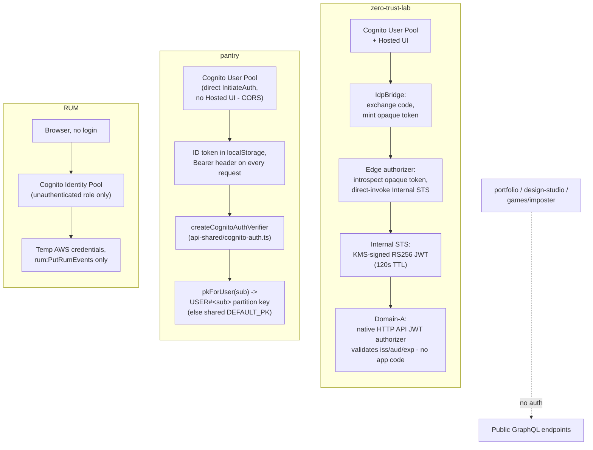

# Identity & access control

Three genuinely different mechanisms share the word "Cognito" here and
shouldn't be conflated - two are real end-user authentication (a person with
a password and a stable identity), one is anonymous AWS-credential vending
with no user identity at all, and three projects have no auth at all.

| Project                                                      | Mechanism                                                     | Identity kind                    |
| ------------------------------------------------------------ | ------------------------------------------------------------- | -------------------------------- |
| [zero-trust-lab](#zero-trust-lab-opaque-token--jwt-exchange) | Cognito User Pool + Hosted UI → opaque token → KMS-signed JWT | Real user                        |
| [pantry](#pantry-direct-cognito-per-user-data-isolation)     | Cognito User Pool, direct `InitiateAuth` (no Hosted UI)       | Real user                        |
| [RUM](#rum-anonymous-credential-vending-not-identity)        | Cognito **Identity** Pool, unauthenticated role only          | Anonymous (AWS credentials only) |
| portfolio, design-studio, games/imposter                     | none                                                          | Public, unauthenticated          |

## Overview

## zero-trust-lab: opaque token → JWT exchange

Full writeup: [`docs/zero-trust-lab.md`](./zero-trust-lab.md). Summary: a
person logs into Cognito Hosted UI once; `IdpBridgeFunction` exchanges the
OAuth code and mints this lab's own long-lived **opaque token**, stored in
DynamoDB and bound to the Cognito `sub` - the browser only ever holds that,
never a real Cognito token. Every subsequent request carries the opaque
token to an edge Lambda authorizer, which introspects it and direct-invokes
(IAM only, no network hop) an internal STS Lambda that mints a short-lived
(120s), audience-scoped JWT signed with a KMS asymmetric key (`kms:Sign` -
the private key never leaves KMS). A separate "domain" gateway validates that
JWT with a **native** HTTP API JWT authorizer - zero application code
involved in verification. Revocation is immediate: deleting the opaque
token's DynamoDB row denies the very next introspection, nothing is cached.

This is the "phantom token pattern" - opaque at the edge, JWT on the inside -
built as a real, isolated AWS stack specifically to get hands-on intuition
for an enterprise gateway pattern, not as a diagram.

## pantry: direct Cognito, per-user data isolation

Its own Cognito User Pool (deliberately not reused from zero-trust-lab -
these two exist for different reasons and shouldn't share state). Unlike
zero-trust-lab, pantry's frontend calls Cognito's `InitiateAuth`/`SignUp`
API **directly** rather than going through Hosted UI's OAuth code flow -
Hosted UI's token endpoint doesn't send CORS headers, which a browser fetch
needs. `PantryAutoConfirmFunction` (a pre-signup Lambda trigger) auto-
confirms new accounts, trading email verification for signup friction on a
personal project.

The resulting ID token lives in `localStorage` (`web/src/pantry/lib/auth.ts`)
and rides as a `Bearer` header on every GraphQL request. Server-side,
`api/src/pantry/handler.ts` verifies it per-request via
`createCognitoAuthVerifier` (`api/src/shared/cognito-auth.ts`, wrapping
`aws-jwt-verify`) - the only piece of auth code actually shared across
projects; it never throws, an invalid/missing token just resolves to
`user: null`. Multi-user data isolation is enforced server-side, not
client-supplied: `context.ts`'s `pkForUser(sub)` maps a verified `sub` to a
`USER#` DynamoDB partition key (falling back to a shared `DEFAULT_PK`
for anonymous use), and every resolver/service reads and writes through that
computed key.

## RUM: anonymous credential vending, not identity

`infra/lib/site-stack.ts`'s `RumIdentityPool` is a Cognito **Identity**
Pool, not a User Pool - it has no authenticated role at all, only an
unauthenticated one (`RumGuestRole`), scoped to a single permission
(`rum:PutRumEvents` on one AppMonitor ARN). There's no sign-in, no user
record, no JWT to verify - it exists purely so an anonymous browser can
obtain short-lived AWS credentials to submit RUM events. Worth naming
explicitly because "Cognito Identity Pool" and "Cognito User Pool" sound
alike but solve unrelated problems: this one authenticates a _browser
session to AWS_, not a _person_.

## No auth: portfolio, design-studio, games/imposter

These three backends have no login, no Cognito, no per-user state - every
GraphQL endpoint is fully public and anonymous, matching their purpose (a
public resume/API demo, a design-tool sandbox, a party game joined by room
code rather than account).
