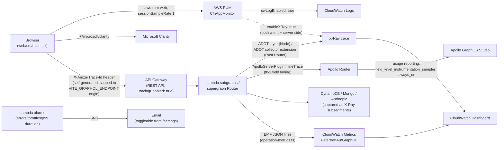

# Observability

Six separate signals, each answering a different question, stitched together
by one shared identifier: the browser-generated X-Ray trace ID.

| Signal                                                         | Question it answers                                                                  |
| -------------------------------------------------------------- | ------------------------------------------------------------------------------------ |
| [RUM](#rum-real-user-monitoring)                               | Was this specific real visitor's page fast, and did anything error in their browser? |
| [Microsoft Clarity](#microsoft-clarity)                        | What did this visitor actually do (session replay, heatmaps)?                        |
| [Apollo GraphOS](#apollo-graphos)                              | Which GraphQL operations run, how often, and which fields are slow?                  |
| [CloudWatch alarms + dashboard](#cloudwatch-alarms--dashboard) | Is a Lambda/table unhealthy right now, and page me if so                             |
| [OTEL/X-Ray tracing](#oteladot--x-ray-tracing)                 | For one request, which hop (API Gateway → Lambda → DynamoDB/Anthropic) was slow?     |
| [CloudWatch Logs](#cloudwatch-logs)                            | What did a specific invocation actually log?                                         |

## Data flow

## RUM (Real User Monitoring)

`web/src/shared/rum.ts` initializes `aws-rum-web`'s `AwsRum` client on every
page load (`main.tsx`), no-op if the app monitor ID / identity pool ID /
GraphQL endpoint env vars are missing (local dev). `sessionSampleRate: 1` -
100% of sessions, justified by this site's low traffic. The `http` telemetry
uses `recordAllRequests: true` because GraphQL always returns HTTP 200 even on
error, so RUM's default "only record non-2xx" would miss everything; GraphQL
errors are instead reported manually via `recordRumError()` wherever a
response's `errors` array is non-empty.

`enableXRay: true` (both here and on the server-side `CfnAppMonitor` in
`infra/lib/site-stack.ts`) is what makes this genuinely cross-service: the
browser generates its own X-Ray trace ID and attaches it as
`X-Amzn-Trace-Id` on GraphQL requests, scoped by a regex derived from
`new URL(VITE_GRAPHQL_ENDPOINT).origin` (not hardcoded, so it still matches
in the test environment) - see [CLAUDE.md's note](../CLAUDE.md) on why that
derivation matters. `infra/lib/api-gateway-stack.ts`'s CORS config explicitly
allowlists `x-amzn-trace-id`, and the API Gateway is a REST API rather than
an HTTP API specifically because only REST API's `tracingEnabled` supports
this. `cwLogEnabled: true` also mirrors RUM events into CloudWatch Logs past
RUM's own 30-day retention.

AWS credentials for submitting RUM events come from an **unauthenticated**
Cognito Identity Pool (`RumIdentityPool`) - anonymous AWS-credential vending,
not user identity. See [`docs/identity.md`](./identity.md) for how this
differs from pantry's and zero-trust-lab's real user auth.

## Microsoft Clarity

`web/src/shared/clarity.ts` is a two-line wrapper: `Clarity.init(...)` in
production builds only. Purely client-side session replay/heatmaps, no
backend infra, no cross-linking to X-Ray or GraphOS - the simplest signal in
the stack, included for the qualitative "what did they actually do" view the
other five don't give.

## Apollo GraphOS

`api/src/supergraph`'s Apollo Router auto-starts usage reporting to GraphOS
Studio once `APOLLO_KEY` (from Secrets Manager) and `APOLLO_GRAPH_REF`
(`petertran-au@current`) are set as Lambda env vars - independent of schema
composition, which happens at build time via `rover subgraph publish` in CI
(see the [CI/CD pipeline](../.github/workflows/README.md)), not via Apollo
Uplink at runtime.

Two tunings in `router.yaml` exist specifically because this runs on Lambda:
`telemetry.apollo.batch_processor.scheduled_delay: 1ms` (Lambda freezes the
execution environment immediately after responding, so the default multi-
second batching window would mean usage reports never actually get sent), and
`field_level_instrumentation_sampler: always_on` (overriding Router's 1%
default, since this project's traffic is low enough that 1% sampling would
mean Studio's field-level Insights sees almost nothing). Each federated
subgraph (portfolio/pantry/design-studio) runs
`ApolloServerPluginInlineTrace()` to produce the field-timing data Router
forwards upstream. `web/src/shared/graphqlClient.ts` sends an
`apollographql-client-name: "web"` header so Studio can attribute traffic by
client.

## CloudWatch alarms + dashboard

`infra/lib/monitoring-stack.ts` builds one dashboard per environment
(`petertran-au` prod, `petertran-au-test` for the test env) and, prod only,
one SNS topic emailing the site owner. For every production Lambda,
`infra/lib/shared/alarms.ts`'s `createLambdaAlarms()` creates three alarms,
all wired to that topic:

- **Errors** - >=1 in a 5-minute window, single breach
- **Throttles** - >=1 in a 5-minute window, single breach
- **Duration p99** - >=80% of the function's configured timeout, 2-of-3
  5-minute windows

The dashboard groups these by project (Portfolio, Pantry, Games, Supergraph,
Warm Schedule, Zero Trust Lab): an alarm-status widget, p50/p99 latency,
invocation/error/throttle counts, a Logs Insights query against the EMF
metrics GraphQL Lambdas emit (`api/src/shared/operation-metrics.ts`'s
`emitOperationCountMetric()`, namespace `PetertranAu/GraphQL`), and DynamoDB
consumed-capacity/throttle graphs.

Alerts can be muted without unsubscribing - `AlertsSettingsFunction`
(`api/src/alerts-settings/handler.ts`) flips the SNS subscription's
`FilterPolicy`, surfaced as a toggle on the portfolio site's `/settings`
page (`useAlertsEnabled.ts`).

## OTEL/ADOT + X-Ray tracing

Two different instrumentation mechanisms, because the fleet mixes runtimes:

- **Node Lambdas** (portfolio/pantry/imposter/etc.) attach the ADOT
  JS distro layer (`applyApplicationSignals()` in
  `infra/lib/shared/application-signals.ts`) via
  `AWS_LAMBDA_EXEC_WRAPPER=/opt/otel-instrument`, auto-instrumenting the AWS
  SDK and `undici` (needed for the Anthropic SDK's native `fetch`). This is
  mutually exclusive with CDK's native `Tracing.ACTIVE` - combining both was
  confirmed to duplicate/fragment traces. Manual spans, where auto-
  instrumentation isn't enough (e.g. calling another project's Lambda over
  plain HTTPS, where async context doesn't reliably survive a real `await`),
  go through `api/src/shared/xray.ts`'s `traced()`/`traceHeader()`.
- **The supergraph Lambda** is a Rust binary (`provided.al2023`) with zero
  automatic instrumentation, so `infra/lib/supergraph-stack.ts` instead runs
  a separate ADOT **collector** as a Lambda extension, and `router.yaml`
  exports OTLP to it over local gRPC with `propagation.aws_xray: true`.

End to end: browser (RUM's self-generated trace ID) → API Gateway (REST API,
`tracingEnabled: true`) → subgraph or supergraph Lambda → (supergraph only)
fan-out to portfolio/pantry/imposter Lambdas over HTTPS, each hop carrying the
same trace ID forward → DynamoDB/Anthropic calls as subsegments. The
portfolio site's own `TraceWaterfall.tsx`/`OperationRow.tsx` reconstructs this
as a flat segment tree via `getTraceBreakdown()`
(`api/src/portfolio/lib/aws/xray.ts`), de-duplicating the repeated API
Gateway/Lambda wrapper segments that appear because a request now hops
through `api.petertran.au` twice (browser → supergraph, then supergraph →
subgraph).

## CloudWatch Logs

No custom log group or retention policy exists anywhere in `infra/lib/` -
every Lambda uses its default, never-expiring AWS-created log group.
Structured logging is limited to the EMF JSON lines `operation-metrics.ts`
emits (auto-parsed into the `PetertranAu/GraphQL` metric namespace above);
there's no broader structured-logger library in use elsewhere.
